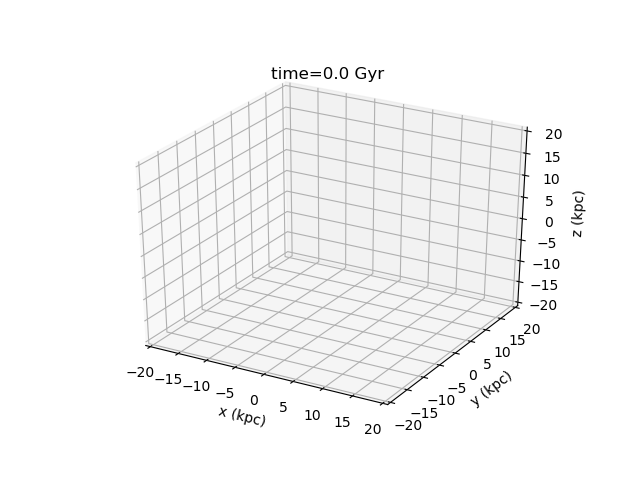

# galaxy-sim

Just a fun little numerical N-body disk galaxy collision simulation.

Simply type `make` on the command line to compile the code, then type `./runsim` and follow the prompts.

The galaxies are constructed with a central (point) mass, representing the bulge, surrounded by a series of concentric rings of non-interacting massless particles undergoing simple Keplerian rotation. The program allows you to alter various parameters of up to four galaxies, including the:

* central mass
* number of rings of each galaxy
* number particles per ring of each galaxy
* initial distances
* initial velocities
* inclination angles

Example of a lone Milky Way analog.

As well as the physical parameters you can also choose the calculation time step, the time step between which the coordinates update, and total integration time.

Have fun destroying some galaxies! :)
